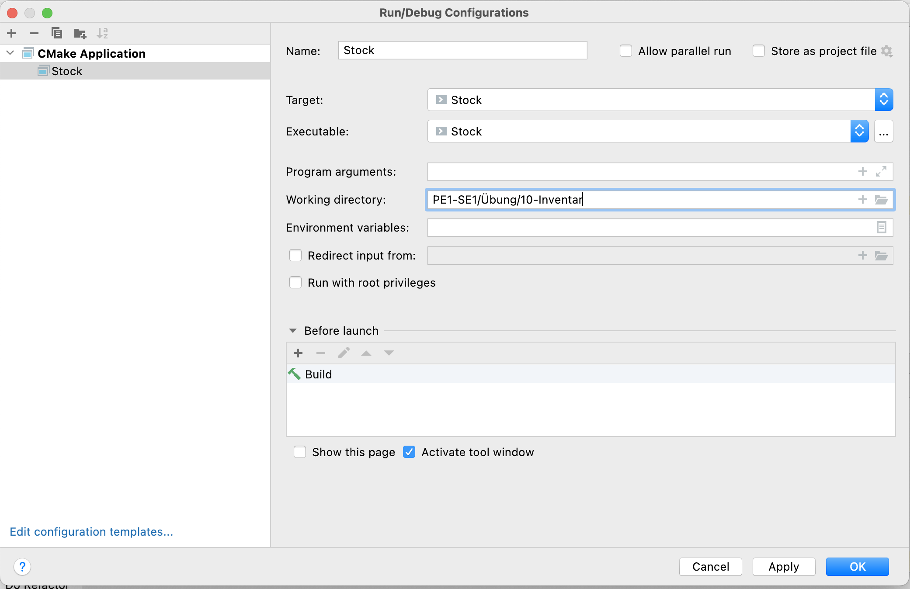

# Aufgabe 10 - Inventarverwaltung

In dieser Aufgabe soll ein Programm zur Inventarverwaltung eines Lagers erstellt werden. Dieses Programm speichert für jeden Artikel unter seiner eindeutigen ID den Stückpreis, die Nummer des Regals und des Fachs, in dem der Artikel sich befindet, sowie die Anzahl der Artikel, die momentan vorrätig sind. Es ist bereits eine Vorlage gegeben, die die generelle Struktur und die Datenmodellierung festlegt.

Das Programm liest und schreibe seine Daten in eine Datei mit dem Namen `inventar.txt`, die im aktuellen Arbeitsverzeichnis liegen muss. Passen Sie im Dialog *Edit Configurations...* das Verzeichnis so an, dass die Datei gefunden wird.



Vorbereitung:

1. Die Vorlage enthält eine Funktion zum Einlesen einer Inventarliste `read_items_from_file`. Leiten Sie aus der Implementierung das erwartete Format der Eingabedatei ab. Wie reagiert die Funktion auf mögliche Fehler?

2. Schreiben Sie eine Funktion `print_stock`, die den aktuellen Inhalt des Lagers ausgibt. Dabei soll die Darstellung wie folgt sein:

```
  ID | price | rack/pos | #items
-----+-------+----------+-------
0022 |  1.50 |   88/2   |     23
0011 |  4.55 |  100/45  |     10
0033 |  7.50 |  101/42  |     22
```

3. Implementieren Sie die Funktion `find_item_stock`, die einen durch seine ID gegebenen Artikel in der Inventarliste findet. Die Funktion soll dabei einen Pointer auf den Eintrag in der Liste zurückgeben, wobei `NULL` zurückgegeben werden soll, wenn die Suche erfolglos ist.

in der Übung:

4. Implementieren Sie die Funktion `add_to_stock`, die eine gewünschte Anzahl von Elementen unter Bezeichnung ihrer ID ins Lager aufnimmt (`add_to_stock`). Dazu soll zunächst geprüft werden, ob der Artikel schon vorhanden ist. Ist dies der Fall, soll lediglich die Stückzahl angepasst werden. Ist dies nicht der Fall, soll nach Stückpreis, dann nach gewünschter Lagerposition gefragt werden, bevor der Artikel in die Inventarliste aufgenommen wird.

5. Es soll eine gewünschte Anzahl von Elementen unter Bezeichnung ihrer ID dem Lager entnehmen werden können (`remove_from_stock`). Ist der Artikel generell oder in der gewünschten Stückzahl nicht vorhanden, soll eine Fehlermeldung ausgegeben werden und der Lagerbestand nicht verändert werden. Werden alle Elemente eines Artikels entnommen, soll der Eintrag aus der Inventarliste gestrichen werden.

6. Die Inventarliste soll bei Beendigung des Programms in der gegebenen Datei `inventar.txt` abgespeichert werden, damit diese beim erneuten Start des Programms wieder verfügbar ist. (*Tipp:* Am besten passen Sie den Namen der Ausgabedatei an, solange Sie die Funktion entwickeln und testen. Zur Sicherheit existiert in der Vorlage eine Kopie der ursprünglichen Inventarliste.)

Zusatz-Aufgaben für Fortgeschrittene:

7. Der aktuelle Lagerbestand soll in der Konsole stets geordnet nach Position (Regal bzw. Fach) ausgegeben werden, um eine Inventarisierung zu unterstützen.

8. Ergänzen Sie die Struktur `item_s` um eine String `name`, der den Namen des Artikels speichert. Ergänzen Sie alle Funktionen in der Vorlage, so dass diese den neuen Namen eines Artikels unterstützen.

