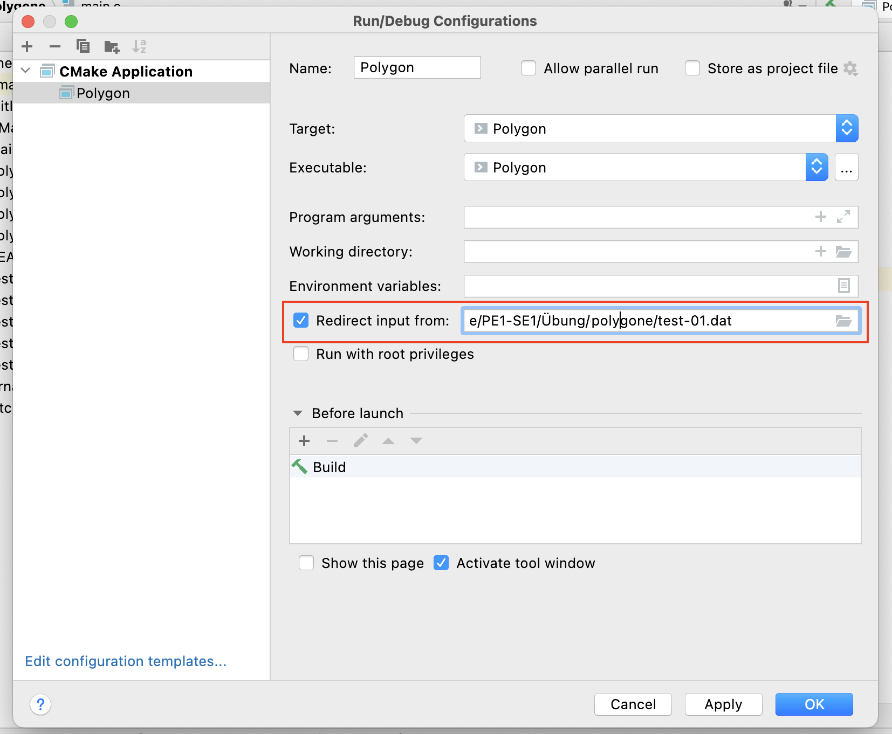

# Aufgabe 04: Polygone

In dieser Aufgabe soll ein Programm entwickelt werden, das es erlaubt, einige Attribute eines allgemeinen Polygons zu berechnen. Es soll möglich sein, eine Anzahl von Punkten und danach die einzelnen Punkte einzugeben, woraufhin das Programm für das gegebene Polygon die Berechnungen durchführt.


Vorbereitung:

1. Ausgangspunkt für die Implementierung ist ein Programmgerüst, das bereits das Einlesen der Eckpunkte in Koordinatenform realisiert. Die Eckpunkte werden in den beiden Arrays `x` (für die x-Koordinaten der Punkte) und `y` (für die y-Koordinaten der Punkte) gespeichert. Machen Sie sich zunächst mit dem Code aus der Vorlage vertraut.

2. Das Vorlagenverzeichnis enthält zudem einige Test-Polygone. Die *dat*-Dateien enthalten dabei vorgefertigte Eingaben, die die Polygone aus den *png*-Dateien darstellen. Wenn Sie eine *dat*-Datei unter *Redirect Input From* im Konfigurations-Dialog (*Edit Configurations...* im Drop-Down links neben dem grünen Dreieck zur Ausführung) angeben, tätigt CLion automatisch die Programmeingaben, so dass man das Programm ohne Interaktion ablaufen lassen kann. Testen Sie dies mit einem der gegebenen Test-Polygone.



4. Erweitern Sie das Programm so, dass nach dem Einlesen der Eckpunkte alle Kanten mit Anfangs-, Endpunkt und Länge ausgegeben werden. Für das erste Beispiel hätte man also die folgende Ausgabe:

```
Kante 0 von 5.00/1.00 nach 3.00/4.00 mit Laenge 3.61
Kante 1 von 3.00/4.00 nach 1.00/1.00 mit Laenge 3.61
Kante 2 von 1.00/1.00 nach 5.00/1.00 mit Laenge 4.00
``` 

4. Ergänzen Sie im Programm, dass die Anzahl der Eckpunkte und der Umfangs des Polygons berechnet und am Ende in der Ergebnisübersicht ausgeben wird.

```
Ergebnisse: (test-01)
-----------
Anzahl Eckpunkte: 3
Umfang: 11.21
```

in der Übung:

5. Die Gesamtfläche eines Polygons kann ausgehend von den Eckpunkten mit Hilfe der [Gaußschen Trapezformel](https://de.wikipedia.org/wiki/Gaußsche_Trapezformel) oder auch dem [Gauß-Elling-Verfahren](https://de.wikipedia.org/wiki/Gauß-Elling-Verfahren) berechnet werden. Die Grundidee dabei ist, dass immer das Trapez unter einer Kante berechnet wird und diese Teilflächen aufsummiert werden. Machen Sie sich mit dem Verfahren vertraut und berechnen Sie von Hand die Fläche für ein Beispielpolygon.

6. Realisieren Sie die Flächenberechnung mit obiger Hilfe. Testen Sie Ihre Implementierung mit den im Projekt gegebenen Polygondaten. Sie können immer davon ausgehen, dass die Eingabedaten stets ein echtes Polygon beschreiben (mindestens drei Eckpunkte, keine kreuzenden Kanten, doppelte Eckpunkte, etc).

7. Das Programm soll schließlich auch den Schwerpunkt berechnen. Dazu können Sie die auf [dieser Seite](https://de.wikipedia.org/wiki/Geometrischer_Schwerpunkt#Polygon) gegebene Formel in C realisieren. Prüfen Sie die Berechnung mit den im Projekt gegebenen Polygondaten.

Zusatz-Aufgaben für Fortgeschrittene:

8. Für den berechneten Schwerpunkt soll geprüft werden, ob er innerhalb oder außerhalb des Polygons liegt. (Dann könnte nämlich ein Objekt mit der Form des Polygons auf diesem einen Auflagepunkt *balanciert* werden.) Dazu können Sie die sogenannte [Even-Odd-Regel](https://wrf.ecse.rpi.edu/Research/Short_Notes/pnpoly.html) nutzen.


```
Ergebnisse: (test-06)
-----------
Anzahl Eckpunkte: 6
Umfang: 19.68
Flaecheninhalt: 12.00
Schwerpunkt: 2.11/3.00
Schwerpunkt drinnen? 0
```